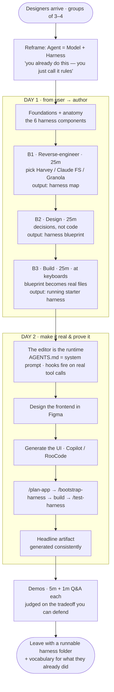
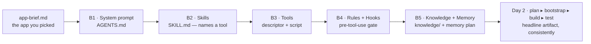

# Participant Journey

*A facilitator-facing map of what the room actually experiences across the two
days of **Agentic Harness Engineering for Product & UX Designers**.*

Use this to brief co-facilitators, set expectations with attendees, or sanity-check
that every exercise still earns its place. It is a companion to the hands-on
material in [`breakout-guides/`](./breakout-guides/) and the Day 2 lab in
[`app-build-template/`](./app-build-template/).

---

## Who is in the room

- **Audience:** product and UX designers — not engineers. Many arrive assuming
  this is an engineering topic they're only visiting.
- **Format:** 2 days × ~2 hours. Work happens in **groups of 3–4** that stay
  together across every breakout.
- **Pacing target:** ~**60% hands-on, 40% lecture.**

The first job of the workshop is a reframe: *"You already touch the harness every
day — you just call it 'rules' or 'instructions.'"* The thesis they carry out is
**Agent = Model + Harness**, and *"if you're not the model, you're the harness"* —
the part designers can actually shape.

---

## The journey, end to end

---

## Day 1 — from *"I use these apps"* to *"I built one"*

After a foundations and anatomy teach (the six components: **system prompt,
skills, tools, rules + hooks, knowledge + memory, evals**), the group runs three
**25-minute breakouts that chain into one continuous build.**

### Breakout 1 — Reverse-engineer
Groups pick a *real shipped product* — **Harvey** (legal), **Claude for Financial
Services**, or **Granola** (meeting notes) — and reason backward from what they can
observe *as users* to the architecture underneath. The deck's metaphor: a chef
tasting a dish to infer the kitchen. The delight and frustration prompts teach
that both surprises *and* failures reveal where the harness's control ends.
**Output:** a **harness map** across the six components.
→ [`breakout-guides/breakout-1-reverse-engineer.md`](./breakout-guides/breakout-1-reverse-engineer.md)

### Breakout 2 — Design
They flip direction: *"If WE built this, what decisions would we make?"* No code
yet — this is the thinking hour. They lock a core intent, a **golden path**
(X → Y → Z), and a **nightmare failure mode**, then record six decisions as
**Decision → Rationale → Tradeoff accepted.**
**Output:** a **harness blueprint.**
→ [`breakout-guides/breakout-2-design-harness.md`](./breakout-guides/breakout-2-design-harness.md)

### Breakout 3 — Build
Now **at keyboards.** They copy a template, open it in VS Code, and turn the
blueprint into real files that Copilot and RooCode actually read — `AGENTS.md` and
the system prompt first. The explicit message: *you won't finish, and that's by
design — "scope lock is a feature, not a limitation."*
**Output:** a **running starter harness** — real decisions in real files, not a
polished artifact.
→ [`breakout-guides/breakout-3-build-harness.md`](./breakout-guides/breakout-3-build-harness.md)

> **The Day 1 payoff is a flip:** from *consumer* of these AI tools to *author* of
> one.

---

## Day 2 — assemble, prove, defend

Day 2 changes shape from *"learn the parts"* to *"make it real and show it works."*
Participants design a frontend in **Figma**, generate the UI with **Copilot /
RooCode**, then run the build-lab slash-command chain:

`/plan-app → /bootstrap-harness → build frontend → /test-harness`

The goal is a **headline artifact the harness produces *consistently*** — not just
once. It closes with **demos: 5 minutes per group, 1 minute of Q&A**, scored on a
rubric. The tone set from the front: *"We're not judging finish — we're judging the
tradeoff you can defend."* A recurring lens makes it land for designers: **each
agent transcript is a usability test.**
→ [`app-build-template/`](./app-build-template/) · [`app-build-template/SEQUENCE.md`](./app-build-template/SEQUENCE.md)

---

## Why it *feels* like one build, not six drills

Every exercise **consumes the artifact the previous one produced** and sets up the
next. A break early in the chain surfaces as a failure *later* — which teaches
participants to fix upstream first.

| Phase | Builds on (input) | Participant produces | The feeling |
|---|---|---|---|
| **B1 · Reverse-engineer** | the app they picked | harness map | curiosity — *"oh, that delight was a harness decision"* |
| **B2 · Design** | B1's map | harness blueprint | ownership — decisions become *theirs* |
| **B3 · Build** | B2's blueprint | running starter harness | momentum — *intuition becomes files* |
| **Day 2 · Assemble** | every decision above | wired app + headline artifact | proof — *"it actually runs"* |
| **Day 2 · Demo** | the working slice | a defended tradeoff | confidence — judged on judgment, not polish |

---

## Design constraints that shape the experience

- **The editor is the runtime.** API keys live *inside* the Copilot / RooCode
  extensions, so participants never train a model or stand up a server. They author
  markdown, JSON, and scripts; the extension's AI plays the agent. Their
  `AGENTS.md` is its system prompt, their hooks fire on real tool calls, their
  prototype is what a user clicks.
- **Scope lock is a feature.** Breakouts are deliberately too short to finish —
  the point is real decisions in real files, not a polished harness.
- **Same groups throughout.** Continuity lets each breakout consume the last one's
  work instead of restarting.
- **Defendable over finished.** The demo rubric rewards the tradeoff a group can
  articulate, not the most complete build.

---

## What participants walk out with

- A **runnable harness folder** they can drop into any project.
- A shared **vocabulary** — system prompt, skills, tools, rules/hooks,
  knowledge/memory, evals — for work many of them were already doing by instinct.
- The core reframe, internalized: **they design harnesses; the harness is where
  the product decisions live.**
