# Harness Anatomy — Visual Reference

Fourteen concepts make up an agent harness. Each diagram below shows
*behaviour*, not file layout — i.e. what happens at runtime when the
agent is working.

For the file-by-file layout and the concept→file mapping, see
[`README.md`](./README.md).

---

## 1. System prompt

The system prompt is **persistent context**. It is prepended to every
turn the agent takes, survives compaction, and sets the persona,
scope, and hard rules.

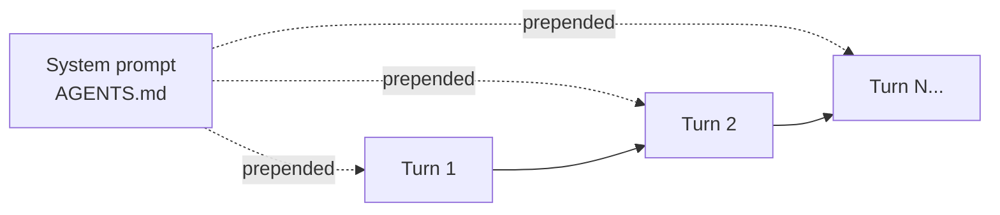

File: `AGENTS.md` (and its mirrors in `AGENTS.md`, `.github/copilot-instructions.md`).

---

## 2. Rules

Rules are **predicates on agent actions**. The agent forms an intent;
the rules layer either lets it through or refuses it. Some rules are
soft (in the system prompt), some are hard (enforced by `settings.json`
allow/deny lists, or by hooks).

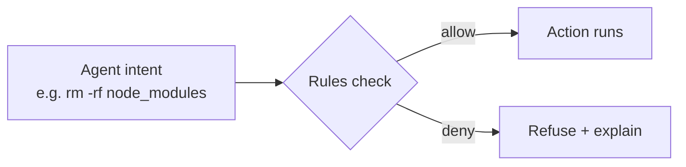

Files: `AGENTS.md` "Hard rules", `.roo/rules/01-project.md`, `.github/copilot-instructions.md` allow/deny.

---

## 3. Skills

A skill is a **prompt loaded on demand**. The agent doesn't carry every
specialist instruction in its base context — it loads the skill only
when a trigger phrase or condition matches. This is "progressive
disclosure" applied to prompts.

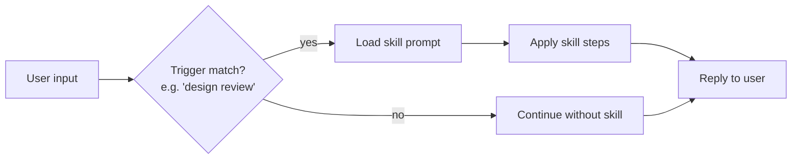

File: `.github/prompts/design-review.md`.

---

## 4. Tools (scripts)

A tool is a **stable, named capability** the agent can invoke. In
practice, most custom tools are scripts with a known interface; the
agent calls them via `Bash` and reads their stdout. The script does
the work in the world (filesystem, network, APIs); the agent only
sees the output.

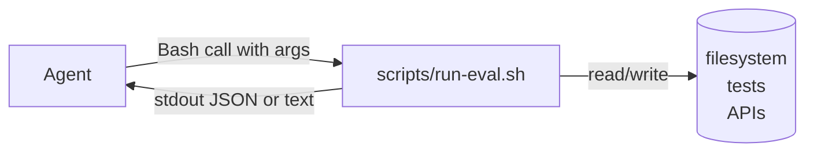

Files: `scripts/run-eval.sh` + `Bash(scripts/run-eval.sh:*)` allow rule in `settings.json`.

---

## 5. Hooks

Hooks **bracket every tool call**. PreToolUse runs before the tool and
can refuse it; PostToolUse runs after and can validate, format, or
log. Hooks are deterministic — they always run, regardless of what the
model decided.

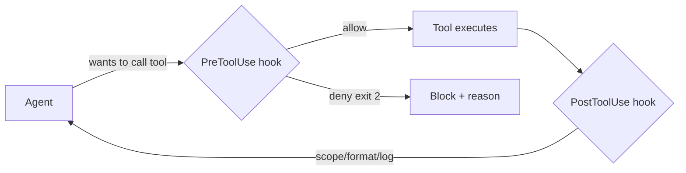

Files: `.github/hooks/pre-tool-use.sh`, `.github/hooks/post-tool-use.sh`, bound via Copilot hook config.

---

## 6. MCPs

An MCP server is a **typed bridge to an external system**. The agent
speaks one protocol (MCP) and gets a uniform tool surface; the server
handles auth, rate limits, and the system's actual API.

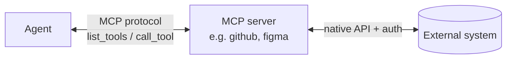

File: `mcp.json`.

---

## 7. Loops

A loop is **observe → act → re-observe with a cap**. The cap is the
key part: a stuck agent shouldn't keep editing forever. Common shape:
run tests, fix one thing, re-run, stop on green or after N iterations.

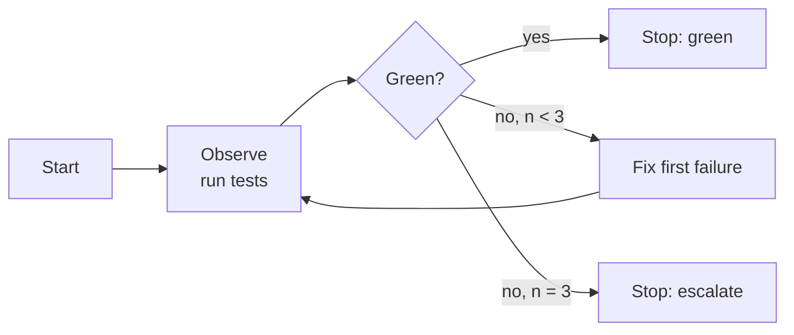

File: `.github/prompts/fix-until-green.md`.

---

## 8. Workflows (skill chains)

A workflow is a **named, ordered sequence of skills, subagents, and
tools** that ships one user-visible outcome. Each step's output is
the next step's input. Workflows are the unit of "we have done this
many times, let's bottle it".

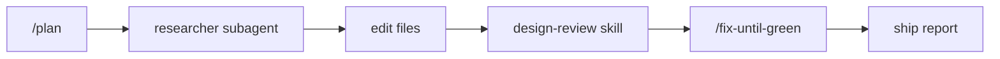

File: `.github/prompts/ship-ui-change.md`.

---

## 9. Subagents

A subagent is **a child agent with a narrower toolset and its own
output contract**. The main agent delegates a task and gets back a
structured result. Subagents are how you keep the main context
small — research, critique, and lookup happen in their own sessions.

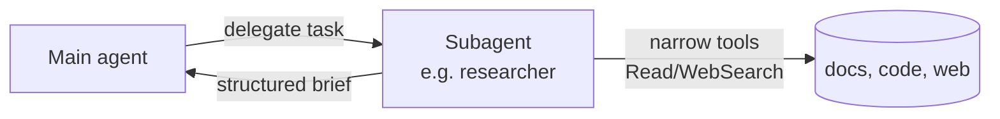

Files: `.github/agents/researcher.md`, `.github/agents/critic.md`.

---

## 10. Agent teams

A team is **multiple subagents on the same input, in parallel, then
merged**. The value is independent perspectives — researcher and
critic should *not* see each other's drafts before producing their
own. The main agent does the merge.

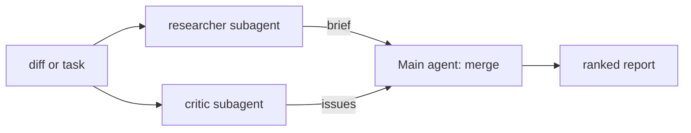

File: `.github/prompts/review-team.md`.

---

## 11. Memory

Memory is **state that survives between sessions**. The system prompt
is static; memory is read at session start and written during/after.
Useful for decisions, names, and conventions you don't want the user
to repeat.

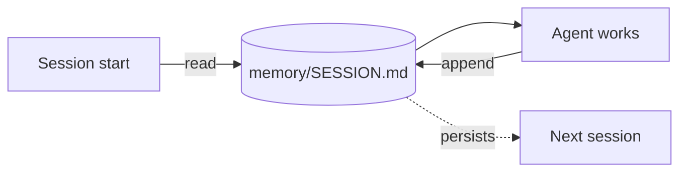

File: `memory/SESSION.md`.

---

## 12. Domain knowledge

Domain knowledge is **facts the agent retrieves on demand**, distinct
from skills (which describe *behaviour*). For workshop-scale harnesses
this is just markdown files; in production, swap in a vector store or
retrieval MCP.

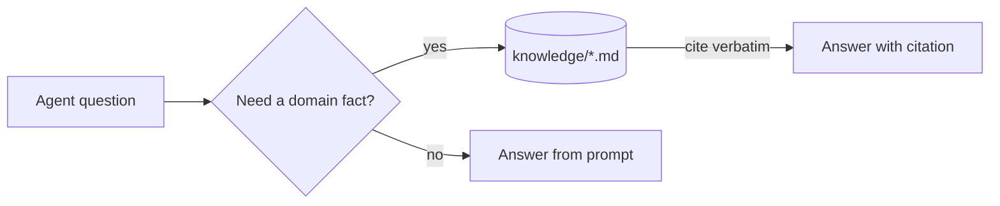

Files: `knowledge/README.md`, `knowledge/style-guide.md`.

---

## 13. Evaluation

Evals are **the regression test for prompts**. A change in AGENTS.md,
a new skill, or a model upgrade can silently break behaviour. Evals
catch that before it ships. One JSON case per behaviour you care
about; one runner script that prints pass/fail per case.

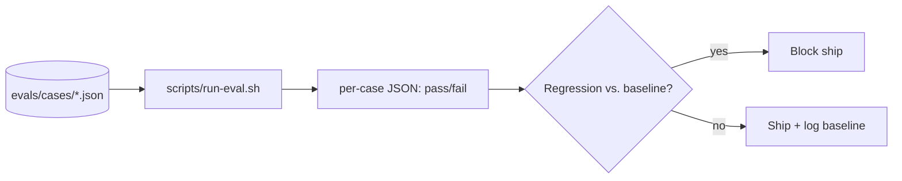

Files: `evals/README.md`, `evals/cases/smoke.json`, `scripts/run-eval.sh`.

---

## 14. Learning

Learning is **how the harness improves between sessions**. You don't
train the model — you refine its prompts, skills, hooks, and tools
based on what real sessions reveal. One change per cycle, evaluated
against the eval set, kept or discarded based on the delta.

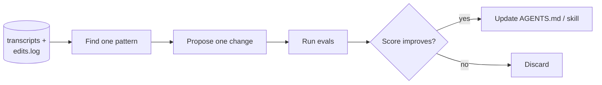

File: `.github/prompts/improve.md`.

---

## How they compose

The fourteen concepts aren't independent. A real harness layers them:

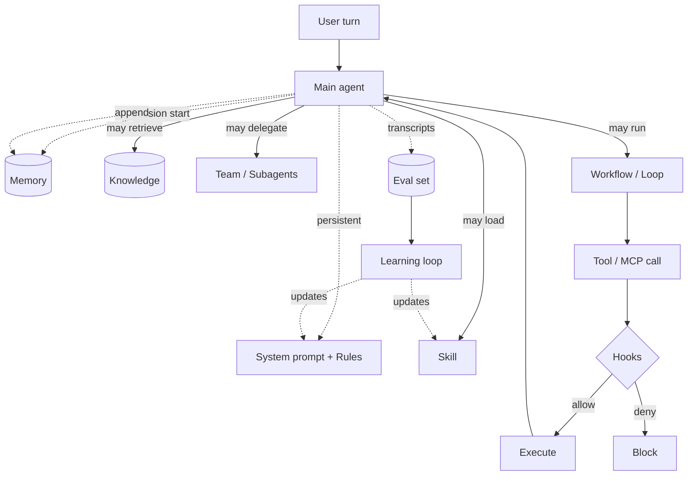
